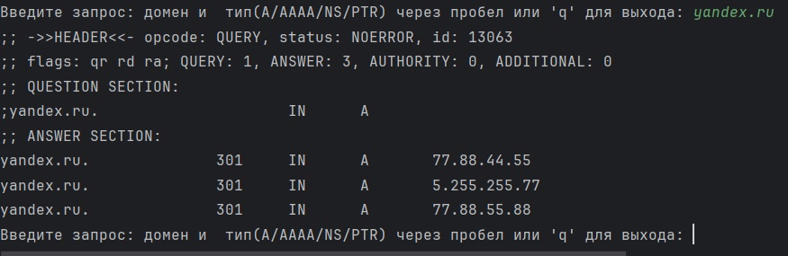
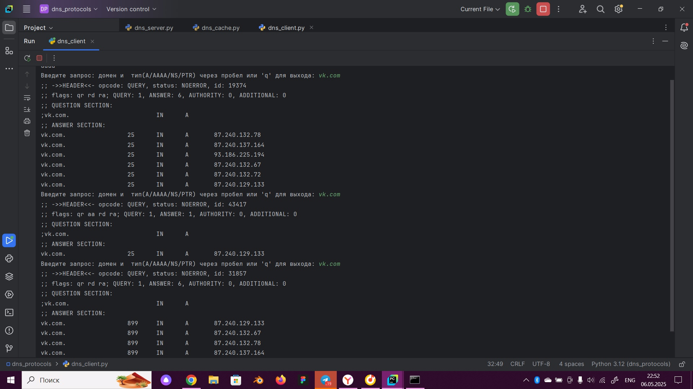
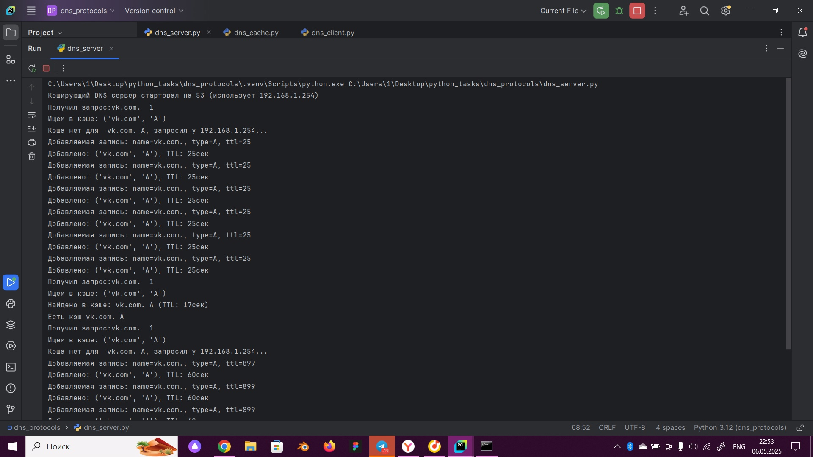
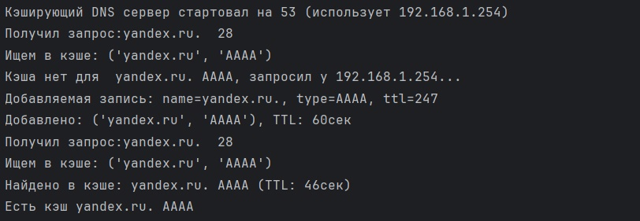
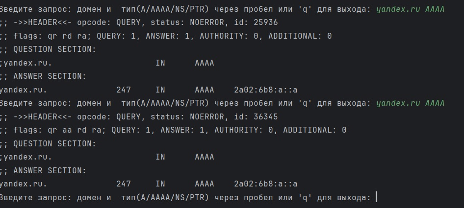
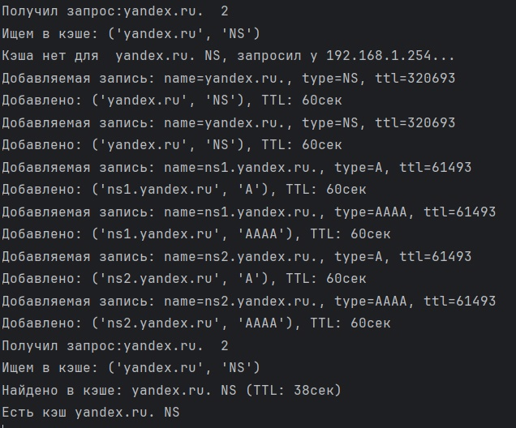
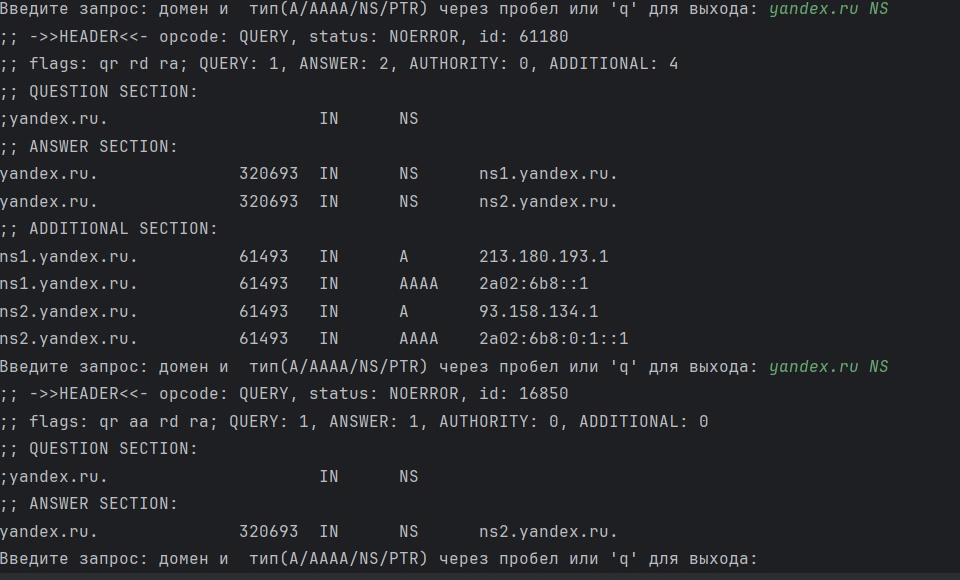
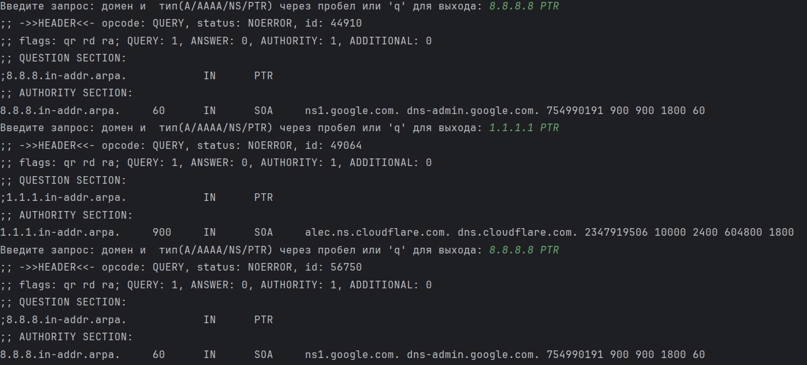
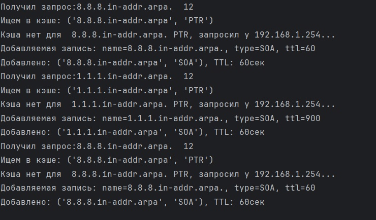

# Кэширующий DNS сервер
## Язык 
python
## Описание
Сервер прослушивает 53 порт. При пер-
вом запуске кэш пустой. Сервер получает от клиента рекурсивный запрос и выполняет разре-
шение запроса. Получив ответ, сервер разбирает пакет ответа, извлекает из него ВСЮ (в том

числе из полей Authority и Additional) полезную информацию, т. е. все ресурсные записи, а не
только то, о чем спрашивал клиент. Полученная информация сохраняется в кэше сервера.
Сервер регулярно просматривает кэш и удаляет просроченные записи (использует поле TTL). Во время штатного вы-
ключения сервер сериализует данные из кэша, сохраняет их на диск. При повторных запусках
сервер считывает данные с диска и удаляет просроченные записи, инициализирует таким об-
разом свой кэш.
## Примеры запусков

