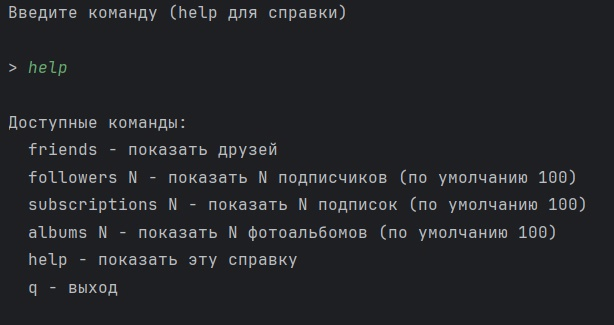
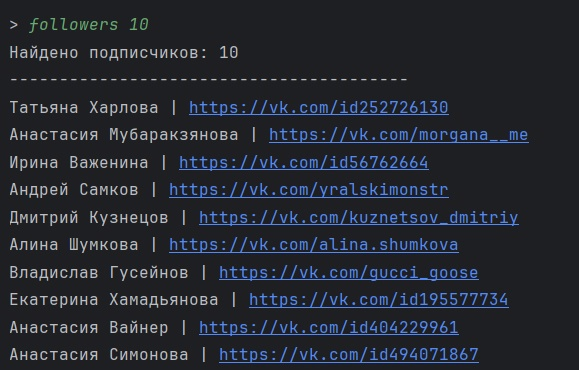
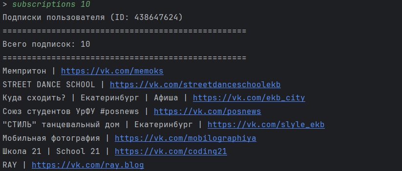
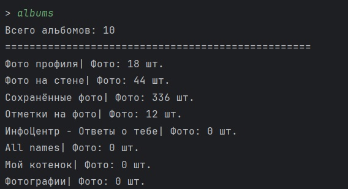

# Использование vk API
## Язык 
python
## Описание
Получает информацию о пользователя и выводит её в человекочитаемом виде
1) get_friends - выводит всех друзей и ссфлки на них
2) get_followers (n) выводит n подписчиков и ссылки на них
3) get_subscriptions (n) выводит n подписок пользователя и ссылки на них
4) get_photo_albums (n) выодит названия фотоальбомов и кол-во фотографий в них
## Примеры запусков

